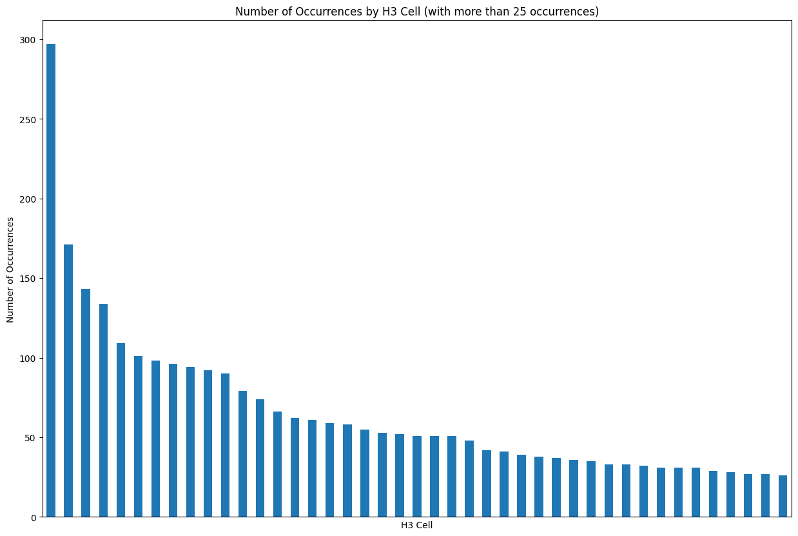

# Range Map Estimation

Estimating mammal encounter rates in Banff and Jasper National Parks using iNaturalist data and H3 spatial indexing.

**Course**: COMP 685 - ML Applied to Climate Change

## Overview

This project analyzes species occurrence data to estimate encounter rates for mammals in the Canadian Rockies. The analysis uses [H3 hexagonal hierarchical spatial indexing](https://h3geo.org/) to discretize the study area and calculate encounter rates per hexagon.


*Figure 1: H3 hexagonal grid showing the steep drop-off in occurrence data, illustrating limited data availability in the region (hexagons with >25 observations)*

## Workflow

1. **Data Download** (`download_request.ipynb`): Fetch occurrence data from GBIF for target species in the study area
2. **Data Preprocessing** (`data_preprocessing.ipynb`): 
   - Convert geographical coordinates to H3 hexagon indices
   - Aggregate occurrences by species and hexagon
   - Calculate encounter rates (occurrences/total observations per hexagon)
3. **Data Visualization** (`data_visualization.ipynb`): Visualize spatial patterns and species distributions

## Key Outputs

- **`encounter_rates_dec10.csv`**: Latest encounter rate matrix (81 species × H3 hexagons)
  - Rows: Species (including subspecies)
  - Columns: H3 hexagon identifiers
  - Values: Encounter rates (0.0 to 1.0)

## Target Species

Includes moose (*Alces alces*), elk (*Cervus canadensis*), wolves (*Canis lupus*), bears (*Ursus* spp.), coyotes (*Canis latrans*), and other mammals found in the region.

## Usage

Run notebooks in order:
1. Update GBIF credentials in `data_visualization.ipynb`
2. Execute `download_request.ipynb` to fetch data
3. Execute `data_preprocessing.ipynb` to process and calculate encounter rates
4. Execute `data_visualization.ipynb` to explore results

## Requirements

Dependencies are listed in `requirements.txt` (autogenerated and may have issues). Install with:
```bash
pip install -r requirements.txt
```
